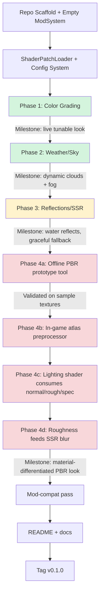

# Vintage Visuals - Implementation Plan

Vintage Visuals is a client-side **rendering framework** for Vintage Story that
ships a visual overhaul. See [ARCHITECTURE.md](ARCHITECTURE.md) for the layering
and for what belongs where; this file is the order of work and the honest state
of each system.

## The ten systems

| System | Layer | State |
|---|---|---|
| Colour management | Image Processing | **renders** - exposure, tonemap, contrast, saturation, white balance, plus an adaptive stack driven by time of day, weather, biome, indoors, depth and underwater |
| Material system | Scene Understanding | **renders** - derived normal/roughness/specular/metal atlas from vanilla textures, keyed on `EnumBlockMaterial`, multi-page, cached |
| Lighting | World Rendering | **renders on terrain only** - full Cook-Torrance with sun, sky, block light and shadow occlusion, but reaching only `chunkopaque` and `chunktopsoil` |
| Environment state | Scene Understanding | **done** - one shared worldview, the only place the game is asked what is happening |
| Weather | Environment | **partly renders** - wetness confirmed on screen; rain fog, cloud shadows, ripples and overcast light compile and are unconfirmed |
| Atmosphere | World Rendering | **not started** - currently a rain modifier inside Weather rather than a system of its own |
| Shadows | World Rendering | **not started** beyond cloud occlusion |
| Water | World Rendering | **not started**. `src/Reflections/` is an empty directory |
| Vegetation | World Rendering | **not started** |
| Post-processing (AO, bloom, DOF) | Image Processing | **not started** |

Two entries in that table are corrections to what the README used to claim.
`src/Reflections/` has always been empty - reflections were never begun - and
the old status text said the PBR pipeline was "not started" and that roughness
and specular were "waiting for a lighting term" long after both had shipped. An
outside review read those lines and concluded the project's top priority was a
lighting model it already has.

## Order of work

Ordered by what unblocks the most, not by visual impact.

### Phase 1 - Foundation (done)

Patch engine with per-group rollback, config with live reload, ConfigLib bridge,
colour grading, eye adaptation, material extraction, PseudoPBR, debug views,
`verifypatches` and `smoketest`.

### Phase 2 - Scene understanding (done)

`EnvironmentState` and its tracker. Everything after this point reads one
worldview rather than sampling the game itself.

### Phase 3 - Lighting reach (next)

The lighting model exists; it reaches two shaders. This phase is about the
other surfaces in the frame, and it is a patching problem rather than a
lighting-theory one.

1. **Entities and held items.** A mob standing on PBR-lit ground is currently
   shaded by a different model than the ground. `entityanimated` and
   `helditem` need the same material lookup and the same lobe.
2. **A shared lighting snippet.** Three programs evaluating the same
   Cook-Torrance means one snippet included by three patch groups, not three
   copies to keep in step.
3. **Contact shadows and crevice shading.** The material system already
   produces a normal and an implied height; short-range occlusion derived from
   them is the cheapest depth cue available and needs no new buffer.

### Phase 4 - Atmosphere as its own system

Split the concept properly. Today "rain fog" is a weather effect that reaches
into vanilla's fog. It should be:

```
Atmosphere (always present)  +  Weather modifiers  ->  final atmospheric state
```

so that a future weather type inherits the rendering rather than adding another
special case. Aerial perspective, distance haze, sun and moon attenuation,
horizon colour.

### Phase 5 - Weather as a material transformation

The abstraction to aim for is:

```
Base material  +  environmental layer(s)  ->  surface response
Stone + wetness + snow + frost
```

Wetness already works this way. Snow should too - smoother normal, higher
roughness, lighter albedo, accumulated height on up-facing sky-exposed
surfaces - rather than being particles that happen to fall.

### Phase 6 - Water

Fresnel, screen-space reflection, refraction, wave normals, depth colouration,
rain disturbance, and underwater absorption and caustics. Coherent as one
renderer; incoherent as "SSR bolted onto vanilla water".

### Phase 7 - Emissive materials

`EmissionColor`, `EmissionStrength`, `EmissionFlicker`, `EmissionTemperature`
as material properties, so a forge produces illumination, highlights on metal,
warm reflections and atmospheric glow rather than an orange texture.

### Phase 8 - Vegetation

Wind deformation by plant class, backface translucency, leaf-specific
roughness, seasonal response.

### Phase 9 - Image processing

Restrained bloom driven by actual emissive intensity rather than brightness.
SSAO separated from contact shadows and crevice shading, so the three scales of
occlusion stay independent. Optional camera effects, all defaulting to off -
mandatory grain and chromatic aberration are the fastest way to make this feel
like a generic shader pack.

### Phase 10 - Performance and temporal

Quality tiers, a rendering debug HUD, and temporal accumulation if the renderer
turns out to allow it. Tiers should be built before the expensive systems land,
not after: a preset that configures subsystem quality, which configures
individual settings, with every individual setting still reachable.

---

# Original plan (Phase 1 detail, retained)

The material below is the original day-zero plan. It is kept because its
decision table is still the record of *why* the foundation is shaped as it is.

## 0. Architecture Decisions (lock these before writing code)

| Decision | Choice | Why |
|---|---|---|
| Shader integration method | **YAML regex patching** over vanilla `.fsh`/`.vsh`, not full-file replacement | Survives game updates better, coexists with other shader mods (pattern used by Coriaender / Volumetric Shading Refreshed) |
| PBR map generation | **Preprocess at texture-atlas build time**, cached, not per-frame | Sobel/variance/BFS passes are too expensive to run every frame per-texel |
| Config/UI | Use **ConfigLib** integration + a Ctrl+C style debug menu | Matches community convention, avoids building a settings UI from scratch |
| Module boundaries | 4 independent, toggleable subsystems (ColorGrade, Weather, Reflections, PseudoPBR) | Lets each ship and be tested/disabled independently; PBR maps feed Reflections but Reflections must degrade gracefully without them |
| Repo layout | Single mod, multiple internal namespaces, one shaderpatches folder per subsystem | Keeps patch conflicts traceable to a subsystem when debugging |

---

## 1. Repository Scaffolding (Day 0)

```
/YourModName
  modinfo.json
  modicon.png
  /assets/yourmodname/
    /shaders/            <- your NEW standalone shaders (post-process, compute)
    /shaderpatches/       <- YAML regex patches against vanilla .fsh/.vsh
      colorgrade.yaml
      weather.yaml
      reflections.yaml
      pbr.yaml
    /lang/
  /src/
    YourModSystem.cs       <- ModSystem entrypoint
    /ColorGrade/
    /Weather/
    /Reflections/
    /PseudoPBR/
      AtlasPreprocessor.cs
      NormalFromLuminance.cs
      RoughnessFromVariance.cs
      SpecMaskFromColorAvg.cs
    /Common/
      ShaderPatchLoader.cs
      ConfigManager.cs
  README.md
  CHANGELOG.md
  .gitignore
```

**Commit 1:** scaffold + empty ModSystem that loads and logs "Hello World" on
game start. Confirms build pipeline works before any shader code exists.

Reference repos to pull boilerplate from:
- `anegostudios/vsmodexamples` → `ScreenOverlayShaderExample`, `HudOverlaySample`
- Coriaender Shaders (Codeberg) → shaderpatches YAML structure, build pipeline
  that renames `.frag/.vert/.glsl/.comp` → `.fsh/.vsh/.ash/.comp` at build time

---

## 2. Phase Order (build in this sequence — each phase is independently shippable)

**Why this order:** color grading has zero dependencies and validates your
patch pipeline cheaply. Weather is visually rewarding and still low-risk.
Reflections needs the render pipeline understanding you'll have built by
then. PBR is last because it's the most novel/unproven and everything else
should be stable before you're debugging texture-atlas preprocessing bugs.

### Phase 1 — Color Grading (lowest risk, validates your whole pipeline)
1. Get `ShaderPatchLoader` working: read a YAML file, regex-match against
   `final.fsh`, apply replacement, log success/failure clearly.
2. Patch `final.fsh` to insert a tonemap + exposure + saturation/contrast
   function before final output.
3. Expose 4 config values (exposure, saturation, contrast, temperature) via
   ConfigLib.
4. **Milestone:** toggling config values visibly changes the game's look with
   no crashes across a world reload.

### Phase 2 — Weather / Sky
1. Patch `cloudvolumetric.fsh` for basic volumetric cloud shape (start by
   copying/adapting an existing open-source approach, don't write noise
   functions from scratch).
2. Add cloud-shadow projection onto terrain (requires a shadow-sample pass
   in `chunkopaque.fsh` or shadow shaders).
3. Patch sky shader for Rayleigh-ish scattering gradient + god rays.
4. Tie fog density/color to weather state (rain, time of day) via existing
   `fogandlight.fsh` hook.
5. **Milestone:** clouds cast moving shadows, sky color shifts with sun angle,
   rain visibly darkens/thickens fog.

### Phase 3 — Reflections (SSR)
1. Implement basic screen-space raymarch reflection pass sampling the
   existing depth buffer — start **water-only**, flat plane, no roughness
   input yet (binary reflective/not, like existing mods).
2. Add fallback/fade at raymarch misses (screen edge, occluded) so it
   doesn't produce hard reflection cutoffs.
3. Gate behind the "deferred lighting" pipeline the same way existing mods
   do; add explicit fallback path for non-deferred rendering so the mod
   doesn't hard-crash on unsupported configs.
4. **Milestone:** water reflects sky/terrain, gracefully turns off (not crash)
   with deferred rendering disabled.

### Phase 4 — Pseudo-PBR pipeline
1. **Offline prototype first, outside the game.** Write a standalone
   command-line/script tool that takes a vanilla texture PNG and outputs
   normal/roughness/specular PNGs using Sobel + variance + color-average.
   Validate visually on 10–15 representative vanilla textures before
   touching the live atlas.
2. Port the validated logic into a compute shader (`.comp`) or a
   `TextureAtlasManager` hook (Harmony patch on atlas upload, same pattern
   Ancestral Bliss Shaders uses) that generates 3 sibling atlases at
   world-load time, cached to disk keyed by texture hash so you don't
   recompute every launch.
3. Wire the derived maps into your existing lighting shader: sample all four
   atlases, replace flat Blinn-Phong with roughness/spec-modulated term.
4. Feed roughness/specMask into the Phase 3 reflection pass — blur/attenuate
   reflections by roughness instead of binary on/off.
5. **Milestone:** at least stone, metal ore, and wood block categories show
   visually distinct specular/roughness response without manual per-block
   authoring.

---

## 3. MVP Checklist

Use this as your GitHub Projects board / issue list. Check off top-to-bottom;
don't start a phase's tasks until the previous phase's milestone is met.

- [ ] Repo scaffold builds and loads in-game (empty mod)
- [ ] `ShaderPatchLoader` applies a YAML patch and logs pass/fail clearly
- [ ] Config system (ConfigLib) wired, at least one live-tunable value
- [ ] **Color grade:** exposure/saturation/contrast/temperature tunable live
- [ ] **Color grade:** basic tonemap curve (avoid blown highlights)
- [ ] **Weather:** volumetric clouds render and move
- [ ] **Weather:** clouds cast shadows on terrain
- [ ] **Weather:** sky gradient reacts to sun angle
- [ ] **Weather:** rain affects fog density/color
- [ ] **Reflections:** water SSR working, flat/binary
- [ ] **Reflections:** graceful fallback when deferred rendering is off
- [ ] **Reflections:** edge/occlusion fade (no hard cutoffs)
- [ ] **PBR:** offline prototype tool validated on sample textures
- [ ] **PBR:** normal map atlas generated in-game, cached to disk
- [ ] **PBR:** roughness atlas generated in-game, cached to disk
- [ ] **PBR:** spec-mask atlas generated in-game, cached to disk
- [ ] **PBR:** lighting shader consumes all 3 derived maps
- [ ] **PBR → Reflections integration:** roughness modulates SSR blur
- [ ] Mod-compat pass: verify no crash when loaded alongside 1–2 popular
      existing shader mods (expect conflicts, document them)
- [ ] README with config docs + known limitations
- [ ] Tag v0.1.0

---

## 4. Flowchart



Legend: green = low risk/well-trodden, yellow = medium risk (pipeline
dependency, fallback needed), red = novel/experimental, validate offline
before committing to live game code.

---

## 5. Working Agentically / Committing Strategy

Since you're planning to commit this agentically:

- **One commit per checklist item**, not per phase. Small, revertable units —
  shader patch work is fragile and you will need to `git bisect` when a
  patch breaks on a game update.
- **Branch per phase** (`phase/color-grade`, `phase/weather`, etc.), merge to
  `main` only at a milestone, tag a pre-release at each milestone
  (`v0.1.0-colorgrade`, `v0.1.0-weather`, ...).
- Keep the **offline PBR prototype tool** in `/tools/` as a separate
  standalone script, not entangled with the mod's C# build — it's a
  content-authoring aid, not runtime code, and iterating on it shouldn't
  require a game restart.
- Log every shader patch failure loudly and distinctly (mirror what
  Ancestral Bliss Shaders does — "Critical shader patch failure in X" +
  automatic fallback) so future-you debugging a version bump isn't guessing.
- Write the README's "known limitations" section as you go, not at the end —
  you will forget the SSR occlusion caveat and the Sobel-misreads-painted-
  shading caveat by the time you get to Phase 4.
